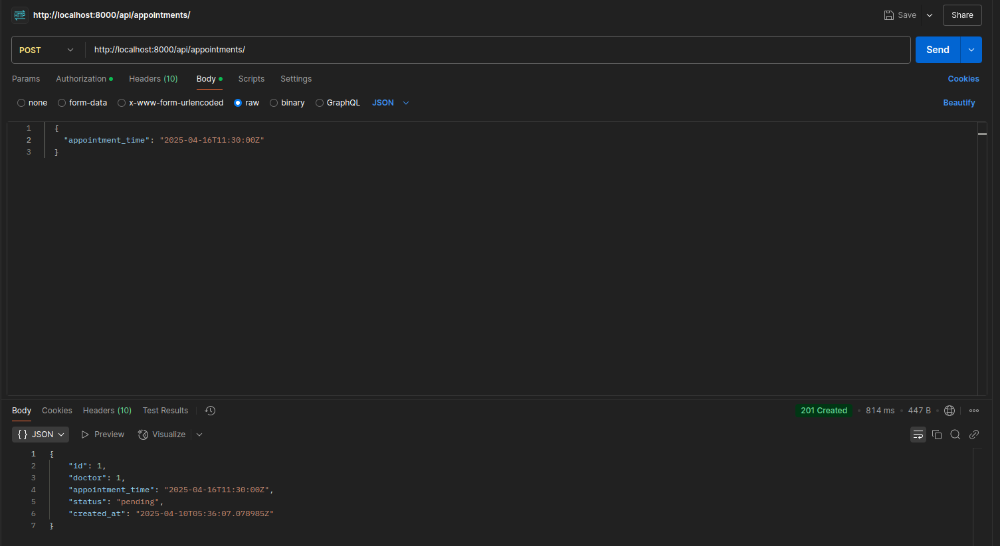

# Matibabu
A django application which helps patients schedule their appointments with doctors and  handle medical records


---

## 🛠️  Setup Guidelines

### 1. Clone the Repo

## ⚒️ Setup Guidelines

### 1. Clone the Repository
```bash
git clone https://github.com/Kimani-Dominic/Matibabu.git
cd Matibabu
```

### 2. Create & Activate Virtual Environment
```bash
python3 -m venv venv
source venv/bin/activate
```

### 3. Install Requirements
```bash
pip install -r requirements.txt
```

### 4. Set Up `.env` File
Create a `.env` file and configure:
```
DATABASE_NAME=tiba_db
DATABASE_USER= your_username  
DATABASE_PASSWORD= your_password
DATABASE_HOST=localhost
DATABASE_PORT=5432
```

### 5. Apply Migrations 
If they have issues, you can run each app migrations separately 
eg.
```python manage.py makemigrations Auth ```

```bash
python manage.py makemigrations
python manage.py migrate
```

### 6. Create Superuser
```bash
python manage.py createsuperuser
```
### 7. Run Server
```bash
python manage.py runserver
```

### 8. Access Admin & Docs
- Admin: `http://127.0.0.1:8000/admin/`
- Swagger Docs: `http://127.0.0.1:8000/swagger/`
- ReDoc: `http://127.0.0.1:8000/redoc/`


---

## API Documentation

The API endpoints are structured as follows:

### Authentication

### `POST /api/register/`  
Registers a new user.  
**Payload:** `username`, `email`, `password` , `role`
**Response:** User details with token  

### `POST /api/login/`  
Authenticates a user.  
**Payload:** `username`, `password`  
**Response:** Auth token

## 👥 Patients
### `POST /api/register-patient-info/`  
Registers additional patient profile data for an authenticated user after login.  
**Payload:** `dob`, `phone`, `address`, `insurance_provider`, `insurance_number`  
**Auth required:** ✅

### `PUT /api/update-patient/`  
Updates an existing patient’s profile.  
**Payload:** Partial or full patient fields  
**Auth required:** ✅


## 🧑‍⚕️ Doctors

### `POST /api/doctor/info`  
Creates doctor profile information .  
**Payload:**  `specialty`, `bio`, `available_days`, `available_hours`.
**Auth required:** ✅

### `PUT /api/doctor/info`  
Creates or updates doctor profile information.  
**Payload:** Partial  
**Auth required:** ✅

---

## 📅 Appointments

### `POST /api/appointments/`  
Creates a new appointment.  
**Payload:**  `date`, `time`.  
Only users with user role patients can create appointments
**Auth required:** ✅ 


### `GET /api/appointments/`  
Retrieves a list of appointments for the logged-in user and doctors who is scheduled for the appointment.  
**Auth required:** ✅

### `PUT /api/appointments/<int:pk>/update/`  
Updates the status of a specific appointment i.e approved, cancelled, completed.  
**Auth required:** ✅


## 📁 Medical Records

### `POST /api/records/create/`  
Creates a new medical record entry for a patient.  
**Payload:**  `diagnosis`, `treatment`, `notes`  
**Auth required:** ✅

### `GET /api/records/`  
Lists all medical records associated with the logged-in user i.e patient.  
**Auth required:** ✅


## 📄 API Docs UI

- `GET /swagger/` – Swagger UI interactive documentation  
- `GET /redoc/` – ReDoc alternative documentation interface  


### Postman collections
Enable basic Auth and enter the basic Auth credentials since the Api endpoints are protected and will be throwing a `403 Unathorized` error whenver trying to try them out using the webapp.

Register  User - `http://127.0.0.1:8000/api/register/`

patient


doctor


appointment
