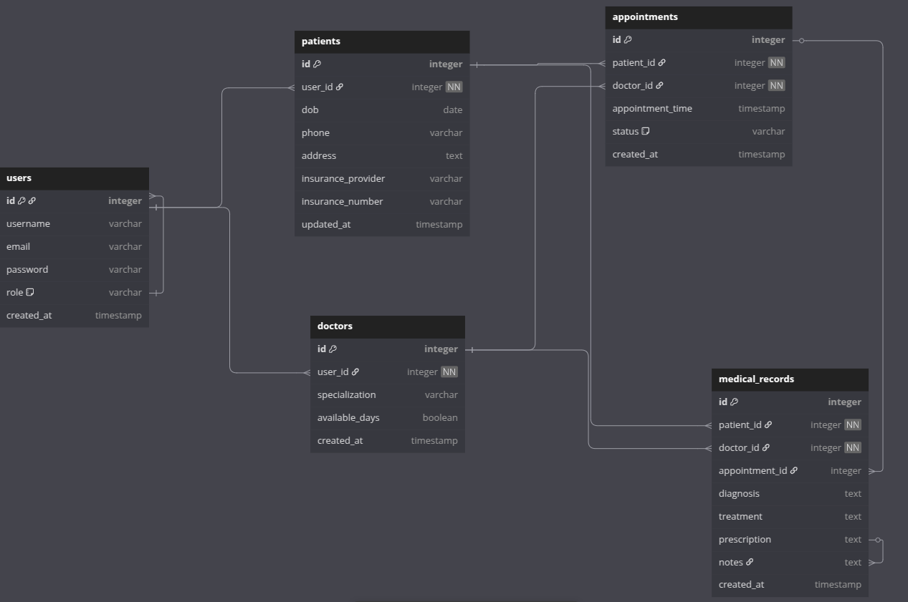

## Matibabu Documentation

**Matibabu** is HMIS (Health Management Info System) that allows users to create profiles based on their user roles, i.e patient or doctor, appointments and medical records. A user who by default is a patient can create an appointment to a doctor, who then associates a medical record with the appointment

## App Properties

### 1. User Authentication and Authorization
- Secure login and authentication using OAuth 2.0.
- Role-based access control for **Patients, Doctors, and Admins**.

### 2. Patient Management
- Register, update, and manage patient profiles.
- Store medical history and insurance details.
- View past and upcoming appointments.

### 3. Doctor Management
- Register and manage doctor profiles, including specialization.
- View and manage assigned patient appointments.
- Can also register as patients

### 4. Appointment Scheduling
- Patients can book, reschedule, or cancel appointments.
- Doctors can approve or decline appointments.
- Admins can oversee all appointments.

### 5. Medical Report Management

The **Medical Records** module allows doctors and authorized users to maintain and access patients' medical history.

- Create and manage patient medical records
- Secure access control (only authorized users can view/edit)
- Store past diagnoses, treatments, prescriptions, and lab results
- Integration with appointments

### 6. API Documentation
- API endpoints are documented using **Swagger**.
- Available at `http://localhost:8000/swagger` for interactive API testing.

---

## System Architecture

### 1. Technology Stack
| Component       | Technology Used |
|----------------|----------------|
| Backend        | Django |
| Database       | PostgreSQL      |
| Authentication | Token-based Auth |
| API Docs       | Swagger |

### 2. System Design
- **Client-Server Model:** Uses a REST API Development to handle requests.
- **Role-based Access Control (RBAC):** Manages access levels for Patients and Doctors
- **Database Design:** Uses PostgreSQL with well-structured models for **Users, User Management, Appointments, and Medical Records**.

### 3. Database Schema

### Tables & Relationships

#### **Auth**
- **id**: Primary Key
- **username**: Unique username for the user
- **email**: unique email
- **password**: Encrypted password
- **role**: Boolean to get either a doctor or patient, default for patient

#### **doctors**
- **id**: Primary Key
- **user**: ForeignKey to `AuthUser` (one-to-one relationship)
- **specialization**: Doctor's specialization
- **available_days**: Boolean indicating if the doctor is available

#### **patients**
- **id**: Primary Key
- **user**: ForeignKey to `AuthUser` (one-to-one relationship)
- **dob**: Date of birth
- **phone**: Patient's phone number
- **address**: Address of the patient
- **insurance_provider**: : Name of the insurance provider
- **insurance_number**: Insurance number

#### **appointments**
- **id**: Primary Key
- **patient**: ForeignKey to `Patient` (one-to-many relationship)
- **doctor**: ForeignKey to `Doctor` (one-to-many relationship)
- **appointment_time**: Date and time of the appointment
- **status**: Status of the appointment (pending, confirmed, completed, canceled)

#### **MedicalRecords**
- **id**: Primary Key
- **patient**: ForeignKey to `Patient` (one-to-many relationship)
- **doctor**: ForeignKey to `Doctor` (one-to-many relationship)
- **appointment**: ForeignKey to `Appointment` 
- **diagnosis**: Diagnosis details
- **treatment**: Treatment details
- **prescription**: prescription details
- **notes**: Additional notes

---

#### Database Schema Diagram

#### Appointment sequence diagram

### 4. Design Decisions

#### Role-Based Access Control (RBAC):

- Patient Role: Only authenticated users with the patient role can create appointments.

- Doctor Role: Only users with the doctor role can create medical records linked to specific appointments.

#### Appointment Model:

- Linked appointments to the logged-in patient and doctor.

- Ensured appointment availability by checking for conflicts based on doctor and appointment_time.

#### MedicalRecord Model:

- Linked medical records to the logged-in patient and their appointment.

- Ensured access to sensitive medical information only by authorized roles.

#### Authentication & Access Control:

- Enforced that only authenticated users can create appointments or medical records.

- Doctors can only create medical records for patients and their specific appointments.

#### Data Integrity:

- Used Django model relationships (ForeignKey, OneToOneField) to ensure appointments and medical records are properly linked.

#### Security:

- Sensitive medical information is only accessible by authorized users, e.g., doctors.

- Password and email validation ensure secure user registration.

#### Experience with Bahmni Appointment Scheduling
Having worked with **Bahmni**, a comprehensive healthcare platform, the design leverages similar concepts to appointment scheduling and medical records management:

- **Appointment Booking**: Just like Bahmni, we validate the doctor’s availability by checking if they are already booked at the requested time.

- **Role-Based Access**: Similar to Bahmni’s role-based access to sensitive medical data, our system ensures that only patients can book appointments, and only doctors can manage medical records.

- **Medical Record Association**: Like Bahmni, the medical record is tied to a specific appointment and patient, with strict access controls for sensitive data.